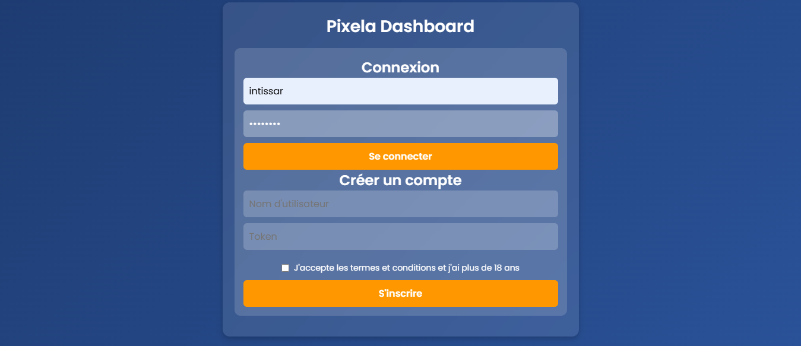
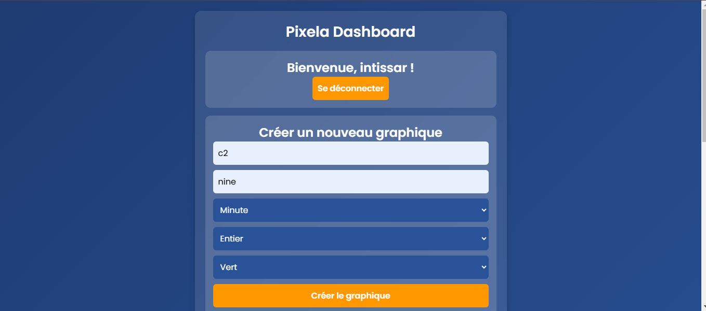
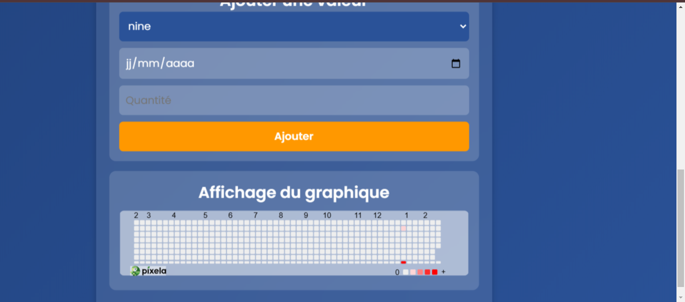

# Pixela Web Client

## Description
Ce projet est un client web permettant d'interagir avec l'API [Pixela](https://docs.pixe.la) en utilisant jQuery. Il permet aux utilisateurs de gérer leurs graphes et pixels directement depuis une interface web.

## Fonctionnalités

### Authentification
- Inscription (création d'un compte Pixela)
- Connexion (stockage du token dans le localStorage)
- Déconnexion

### Gestion des Graphes
- Création d'un graphe
- Liste des graphes de l'utilisateur connecté

### Gestion des Pixels
- Ajout d'un pixel à une date donnée
- Suppression d'un pixel à une date donnée

### Gestion des erreurs
- Gestion des cas d'erreurs possibles (mauvaise authentification, erreurs API, etc.)

## Technologies utilisées
- HTML/CSS
- JavaScript (jQuery)
- API Pixela

## Utilisation
1. Inscrivez-vous ou connectez-vous avec votre token Pixela.
2. Gérez vos graphes : création, affichage.
3. Ajoutez ou supprimez des pixels sur vos graphes.

## Captures d'écran
Voici quelques aperçus de l'interface :

---
Projet réalisé dans le cadre d'un exercice d'intégration avec l'API Pixela.
